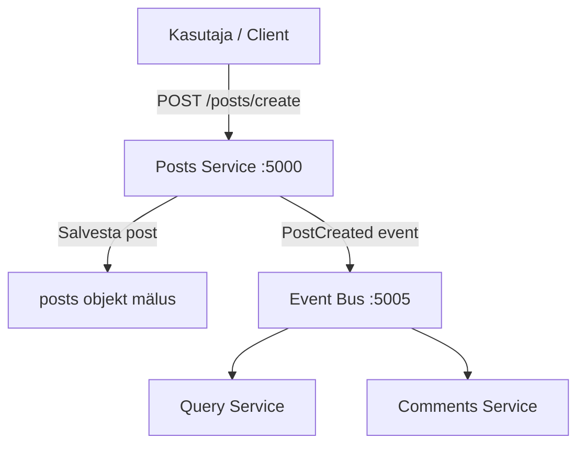

&nbsp;

\# Overview

The **Posts Service** is a backend microservice responsible for handling blog posts in the application.&nbsp;&nbsp;

Its main tasks are creating posts and returning existing posts to the client.

This service is part of an **event-driven microservices architecture**, where changes are communicated to other services via an Event Bus instead of direct service-to-service calls.

**Key goals of this service:**

\- Keep post-related logic isolated

\- Communicate changes using events

\- Remain simple and independently deployable

**Technology stack:**

\- Node.js

\- Express.js

\- Axios (event communication)

\- In-memory data storage

&nbsp;

&nbsp;

\## Responsibilities

The Posts Service is responsible for:

\- Creating new blog posts

\- Generating unique post IDs

\- Storing posts in memory

\- Publishing events when a post is created

This service does **not**:

\- Handle comments

\- Persist data permanently

\- Query combined post/comment data

&nbsp;

\## Dependencies

The service relies on the following main dependencies located in <SwmPath>\[posts/\](/posts/)</SwmPath>:

\- `express` – HTTP server framework

\- `cors` – Enables cross-origin requests

\- `axios` – Used to send events to the Event Bus

\- `nodemon` – Automatically restarts the service during development

&nbsp;

\### Installing dependencies

\`\`\`bash

cd posts

npm install

&nbsp;

&nbsp;

\---

\##  Running the Service

\`\`\`md

\## Starting the Service

The Posts Service can be started using the predefined npm script.

\`\`\`bash

cd posts

npm start

&nbsp;

\## Internal Workflow

When a client creates a post, the service performs two main actions:

1\. Stores the post in an in-memory object

2\. Sends a `PostCreated` event to the Event Bus

This approach allows other services (such as Query or Comments) to react independently.



&nbsp;

<SwmSnippet path="/posts/index.js" line="1">

---

/posts

```javascript
const express = require('express');
const cors = require('cors');
const axios = require('axios');

const app = express();
app.use(cors());
app.use(express.json());

let posts = [];
let lastId = 0;

app.get('/posts', (req, res) => res.json(posts));

app.post('/posts', async (req, res) => {
  const { title, content } = req.body;
  if (!title || !content)
    return res.status(400).json({ error: 'Title and content are required' });

  const newPost = { id: ++lastId, title, content };
  posts.push(newPost);

  // Send event to event bus
await axios.post('http://event-bus-srv:5005/events', {
  type: 'PostCreated',
  data: newPost,
});


  res.status(201).json(newPost);
});

app.post('/events', (req, res) => {
  console.log('Received event:', req.body);
  res.send({});
});

app.listen(5000, () => console.log('Posts service running on http://localhost:5000'));
```

---

</SwmSnippet>

&nbsp;

<SwmMeta version="3.0.0" repo-id="Z2l0aHViJTNBJTNBaGFqdXNyYWtlbmR1czElM0ElM0FreWxha2FybGE=" repo-name="hajusrakendus1"><sup>Powered by [Swimm](https://app.swimm.io/)</sup></SwmMeta>
